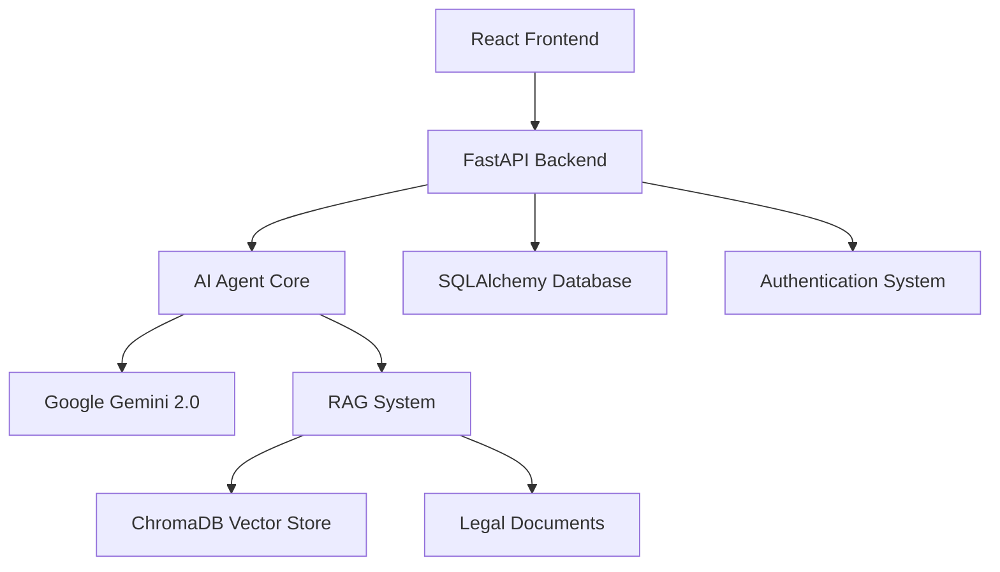

# ⚖️ Law_flow - Your AI-Powered Legal Assistant

<div align="center">


[](https://fastapi.tiangolo.com/)
[](https://reactjs.org/)
[](https://www.typescriptlang.org/)
[](https://www.python.org/)
[](LICENSE)

*Revolutionizing legal services with AI-powered solutions for everyone*

</div>

---

## 🌟 What is Law_flow?

Law_flow (also known as NyayaSetu) is a cutting-edge AI-powered legal assistance platform designed to make legal information accessible to everyone. Built with modern technologies and featuring "Vaanee" - your multilingual AI legal companion - this platform bridges the gap between complex legal concepts and everyday understanding.

### 🎯 Key Features

<div align="center">

| 🤖 **AI Legal Assistant** | 🔍 **Smart Document Analysis** | 👨‍💼 **Lawyer Matching** |
|:---:|:---:|:---:|
| 24/7 multilingual AI companion | Automated legal document review | Find lawyers by specialty & location |
| Voice-to-voice interaction | Detect legal flaws & strengthen arguments | Verified professional network |
| Context-aware responses | Extract key insights instantly | Case-based recommendations |

| 📚 **Legal Knowledge Base** | 🔊 **Voice Interface** | 🛡️ **Secure Platform** |
|:---:|:---:|:---:|
| IPC/CrPC sections explained | Natural voice interactions | Encrypted data storage |
| Constitution & law references | Multilingual support | JWT authentication |
| Real-time legal updates | Intelligent IVR system | Privacy-focused design |

</div>

---

## 🏗️ Architecture



### 🛠️ Tech Stack

**Frontend** 🎨
- **React 18.3+** with TypeScript
- **Tailwind CSS** for styling
- **Framer Motion** for animations
- **React Router** for navigation
- **Axios** for API communication
- **Lottie** for animations

**Backend** ⚙️
- **FastAPI** for high-performance API
- **SQLAlchemy** for database ORM
- **Pydantic** for data validation
- **JWT** for authentication
- **CORS** middleware for cross-origin requests

**AI & ML** 🧠
- **Google Gemini 2.0 Flash** as the core LLM
- **LangChain** for AI workflow orchestration
- **ChromaDB** for vector storage
- **HuggingFace BGE** embeddings
- **RAG (Retrieval Augmented Generation)** for legal knowledge

---

## 🚀 Quick Start

### Prerequisites

- **Node.js** 18+ and npm
- **Python** 3.13+
- **uv** (Python package manager)

### 🏃‍♂️ Development Setup

1. **Clone the repository**
   ```bash
   git clone https://github.com/yourusername/law_flow.git
   cd law_flow
   ```

2. **Setup Backend** 🐍
   ```bash
   cd backend
   uv sync
   uv run uvicorn app:app --reload
   ```

3. **Setup Frontend** ⚛️
   ```bash
   cd frontend
   npm install
   npm run dev
   ```

4. **Environment Variables** 🔧
   
   Create `.env` files in both directories:
   
   **Backend `.env`:**
   ```env
   DATABASE_URL=sqlite:///./law_flow.db
   SECRET_KEY=your-secret-key-here
   GOOGLE_API_KEY=your-google-api-key
   ```

5. **Access the Application** 🌐
   - Frontend: `http://localhost:5173`
   - Backend API: `http://localhost:8000`
   - API Docs: `http://localhost:8000/docs`

---

## 📱 Features Showcase

### 🤖 Meet Vaanee - Your AI Legal Companion

Vaanee is our intelligent AI assistant that:

- **Understands Context**: Provides relevant legal advice based on your specific situation
- **Speaks Your Language**: Supports multiple languages for accessibility
- **Available 24/7**: Get legal guidance anytime, anywhere
- **Voice-Enabled**: Natural voice interactions for seamless communication

### 🎯 Core Capabilities

#### 📋 Legal Query Resolution
```
User: "What does Section 498A mean?"
Vaanee: "Section 498A of the Indian Penal Code deals with dowry harassment..."
```

#### 📄 Document Analysis
- Upload legal documents for instant analysis
- Identify potential issues and recommendations
- Extract key clauses and terms
- Generate simplified summaries

#### 👨‍💼 Professional Network
- Connect with verified lawyers
- Filter by specialization, location, and fees
- Read reviews and ratings
- Schedule consultations

---

## 🏛️ Legal Knowledge Base

Our platform includes comprehensive coverage of:

- **📜 Indian Penal Code (IPC)** sections and explanations
- **⚖️ Criminal Procedure Code (CrPC)** guidelines
- **🏛️ Constitutional Law** provisions
- **📋 Civil Law** procedures
- **💼 Corporate Law** essentials
- **🏠 Property Law** rights and procedures

---

## 🔧 API Documentation

### Authentication Endpoints

```http
POST /api/signup
POST /api/login
GET /api/users/me
```

### Chat Endpoints

```http
POST /api/chat
GET /api/chat/history
```

### File Upload

```http
POST /api/documents/upload
POST /api/documents/analyze
```

For complete API documentation, visit `/docs` when running the backend.

---

## 🤝 Contributing

We welcome contributions! Here's how you can help:

1. **🍴 Fork** the repository
2. **🌿 Create** a feature branch (`git checkout -b feature/amazing-feature`)
3. **💾 Commit** your changes (`git commit -m 'Add amazing feature'`)
4. **📤 Push** to the branch (`git push origin feature/amazing-feature`)
5. **🔄 Open** a Pull Request

### 📋 Development Guidelines

- Follow TypeScript/Python best practices
- Write descriptive commit messages
- Add tests for new features
- Update documentation as needed
- Ensure responsive design for frontend changes

---

## 📜 License

This project is licensed under the MIT License - see the [LICENSE](LICENSE) file for details.

---

## 💬 Support

<div align="center">

### Need Help? We're Here! 🙋‍♂️

[](https://discord.gg/law-flow)
[](mailto:support@lawflow.ai)
[](https://github.com/yourusername/law_flow/issues)

**Documentation** • **Tutorials** • **FAQ** • **Community Forum**

</div>

---

## 🌟 Acknowledgments

- **Google Gemini** for powering our AI capabilities
- **LangChain** for AI workflow management
- **FastAPI** for the robust backend framework
- **React** community for excellent frontend tools
- All our **contributors** and **beta testers**

---

<div align="center">

### ⚖️ Making Justice Accessible, One Query at a Time

**Built with ❤️ by the Law_flow Team**

[](https://github.com/yourusername/law_flow)
[](https://twitter.com/lawflow_ai)

</div>