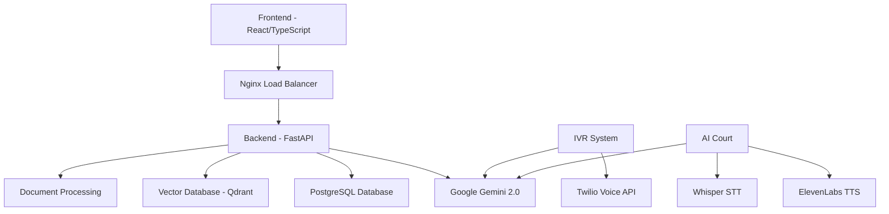

# 🏛️ NyayaSetu - Your Bridge to Justice

<div align="center">

[](https://opensource.org/licenses/MIT)
[](https://www.python.org/downloads/)
[](https://reactjs.org/)
[](https://fastapi.tiangolo.com/)
[](https://ai.google.dev/)

**🤖 AI-Powered Legal Assistant & Virtual Court Simulation Platform**

*Democratizing access to legal knowledge through cutting-edge AI technology*
[🚀 Quick Start](#-quick-start) • [🎯 Demo](#-ai-court-simulation) • [💡 Contributing](#-contributing)

</div>

---

## 🌟 **What is NyayaSetu?**

**NyayaSetu** (Sanskrit: न्यायसेतु = "Bridge to Justice") is a revolutionary AI-powered legal assistance platform that makes legal knowledge accessible to everyone. Whether you're a citizen seeking legal guidance or a lawyer preparing for court, NyayaSetu bridges the gap between complex legal procedures and everyday understanding.

### 🎯 **Mission**
Breaking down barriers to legal access through AI innovation, ensuring justice is within reach for every citizen, regardless of their background or location.

---

## ✨ **Key Features**

### 🤖 **Vaanee - Your AI Legal Voice Assistant**
- **🗣️ Voice-to-Voice Interaction**: Natural conversation in multiple languages
- **🌐 Multilingual Support**: Legal assistance in your preferred language
- **📞 IVR Integration**: Call-based legal guidance with Twilio integration
- **🧠 24/7 Availability**: Round-the-clock legal assistance powered by Google Gemini 2.0

### ⚖️ **AI Court Simulation**
- **🏛️ Virtual Courtroom**: Practice legal arguments in realistic simulations
- **👨‍⚖️ AI Judge**: Intelligent judge responses with legal reasoning
- **🥊 AI Opponent**: Challenging opposing counsel for debate practice
- **🎵 Voice Synthesis**: Natural speech with ElevenLabs voice technology
- **📝 Case Management**: Upload case materials and track practice sessions

### 📞 **IVR System for Local Communities
This system is specifically designed to bridge the legal knowledge gap for local people, ensuring justice is accessible simply by making a phone call.
- **🗣️ Hindi & English Support: Conduct real conversations in both Hindi and English, ensuring language is never a barrier for citizens seeking justice.
- **📱 Accessible by Phone: Users can easily call a dedicated number to interact with the AI assistant in their language of choice.
- **💡 Simple and Intuitive: Designed for ease of use, making legal guidance straightforward for people in both urban and rural areas.

### 📄 **Intelligent Document Processing**
- **📊 AI Summarization**: Extract key insights from legal documents
- **🔍 Legal Analysis**: Understand complex contracts and agreements
- **📤 Multi-format Support**: PDF, DOCX, and text file processing
- **💾 Secure Storage**: Protected document handling with user authentication

### 📅 **Smart Appointment Booking**
- **🕐 Intelligent Scheduling**: AI-powered availability management
- **👥 Lawyer Matching**: Find legal professionals by specialization
- **⏰ Automated Reminders**: Never miss important consultations
- **📱 User-Friendly Interface**: Seamless booking experience

### 🔐 **Secure User Management**
- **👤 Multi-role Support**: Separate dashboards for citizens and lawyers
- **🔒 JWT Authentication**: Secure login and session management
- **📊 Profile Management**: Lawyer verification and specialization tracking
- **🛡️ Data Protection**: Enterprise-grade security standards

---

## 🛠️ **Technology Stack**

<div align="center">

### **Backend Architecture**


### **AI & ML Technologies**


### **Frontend & UI**


### **Communication & Voice**


### **DevOps & Deployment**


</div>

---

## 🚀 **Quick Start**

### Prerequisites
- 🐍 **Python 3.9+**
- 📦 **Node.js 16+**
- 🐳 **Docker & Docker Compose**
- 🔑 **API Keys**: Google AI, ElevenLabs, Twilio (optional)

### 🐳 **One-Click Docker Setup** (Recommended)

```bash
# Clone the repository
git clone https://github.com/your-username/nyayasetu.git
cd nyayasetu

# Set up environment variables
cp .env.example .env
# Edit .env with your API keys

# Launch the entire platform
docker-compose up -d

# Access the application
open http://localhost:3000  # Frontend
open http://localhost:8000  # Backend API
```

### 🔧 **Manual Development Setup**

<details>
<summary>Click to expand manual setup instructions</summary>

#### Backend Setup
```bash
cd backend

# Create virtual environment
python -m venv venv
source venv/bin/activate  # On Windows: venv\Scripts\activate

# Install dependencies
pip install -r requirements.txt

# Set up environment variables
cp .env.example .env
# Edit .env with your configuration

# Run database migrations
# python manage.py migrate  # If using Django
# alembic upgrade head      # If using Alembic

# Start the backend server
uvicorn app:app --host 0.0.0.0 --port 8000 --reload
```

#### Frontend Setup
```bash
cd frontend

# Install dependencies
npm install

# Start development server
npm run dev

# Build for production
npm run build
```

#### IVR System Setup
```bash
cd IVR

# Install IVR dependencies
pip install -r requirements.txt

# Configure Twilio credentials in config.py
# Set up ngrok for webhook URLs

# Start IVR service
python main.py
```

</details>

---

## 🎯 **AI Court Simulation**

Experience the future of legal practice with our revolutionary AI Court feature:

### 🏛️ **Virtual Courtroom Features**
- **Real-time Legal Debates**: Engage with AI-powered opposing counsel
- **Intelligent Judge Responses**: Receive realistic judicial interventions
- **Voice-Enabled Interaction**: Speak naturally with speech recognition
- **Case Material Upload**: Submit evidence and documents for simulation
- **Practice Session Tracking**: Monitor your argument development

### 📋 **How It Works**
1. **📤 Upload Case Materials**: Submit relevant legal documents
2. **🎯 Define Your Position**: Set your legal stance and arguments
3. **🗣️ Start the Debate**: Engage in voice or text-based arguments
4. **👨‍⚖️ Receive Feedback**: Get judicial insights and opponent responses
5. **📈 Track Progress**: Review session history and improvement areas

---

## 📱 **User Interfaces**

### 👤 **Citizen Dashboard**
- 🗣️ Chat with Vaanee AI assistant
- 📄 Document summarization tools
- 📅 Lawyer appointment booking
- 🏛️ AI Court practice access
- 📚 Legal knowledge base

### ⚖️ **Lawyer Dashboard**
- 👥 Client management system
- 📋 Case preparation tools
- 🎯 Court simulation practice
- 📊 Performance analytics
- 💼 Professional profile management

---

## 🌍 **Social Impact & Innovation**

### 🎯 **Democratizing Legal Access**
- **🌐 Geographic Inclusion**: Serving remote and underserved areas
- **💰 Cost Reduction**: Affordable legal guidance for all
- **🗣️ Language Accessibility**: Multi-language support breaking barriers
- **📱 24/7 Availability**: Round-the-clock legal assistance

### 🚀 **Legal Technology Innovation**
- **🤖 AI-Powered Training**: Revolutionary legal education tools
- **📊 Data-Driven Insights**: Analytics for legal decision-making
- **🔄 Continuous Learning**: AI that improves with every interaction
- **🌟 Future-Ready Platform**: Scalable for emerging legal needs

---

## 📊 **API Documentation**

### Core Endpoints

#### 🔐 Authentication
```bash
POST /api/signup     # User registration
POST /api/signin     # User authentication
```

#### 💬 Legal Assistant
```bash
POST /api/chat       # Chat with Vaanee AI
```

#### 📄 Document Processing
```bash
POST /api/documents/summarize-file  # Upload & summarize documents
POST /api/documents/summarize-text  # Summarize text input
GET  /api/documents/history         # Get summary history
```

#### 📅 Appointments
```bash
POST /api/appointments/suggest-slots  # Get available slots
POST /api/appointments/book          # Book appointment
GET  /api/appointments/my-appointments # Get user appointments
POST /api/appointments/{id}/cancel   # Cancel appointment
```

#### ⚖️ AI Court
```bash
POST /ai-court/api/upload_case_materials  # Upload case files
POST /ai-court/api/debate_turn           # Conduct debate turn
POST /ai-court/api/synthesize_speech     # Text-to-speech
POST /ai-court/api/transcribe_audio      # Speech-to-text
```

#### 📞 IVR System
```bash
POST /ivr/make_call        # Initiate voice call
POST /ivr/initiate_call    # Handle incoming calls
POST /ivr/language_select  # Language selection
```

---

## 🔧 **Configuration**

### Environment Variables

```bash
# Google AI Configuration
GOOGLE_API_KEY=your_google_gemini_api_key

# Database Configuration
DATABASE_URL=postgresql://postgres:postgres@db:5432/law_ai

# Voice Services
ELEVENLABS_API_KEY=your_elevenlabs_api_key

# Communication (Optional)
TWILIO_ACCOUNT_SID=your_twilio_account_sid
TWILIO_AUTH_TOKEN=your_twilio_auth_token

# Security
JWT_SECRET_KEY=your_jwt_secret_key
JWT_ALGORITHM=HS256
ACCESS_TOKEN_EXPIRE_MINUTES=30

# Frontend Configuration
VITE_API_URL=http://localhost:8000
```

---

## 🏗️ **Architecture Overview**



---

## 🧪 **Testing**

```bash
# Backend tests
cd backend
pytest tests/ -v --cov=.

# Frontend tests
cd frontend
npm test

# End-to-end tests
npm run test:e2e
```

---

## 📦 **Deployment**

### Production Deployment

```bash
# Production build
docker-compose -f docker-compose.prod.yml up -d

# Scale services
docker-compose up --scale backend=3 --scale frontend=2

# Health checks
curl http://localhost:8000/health
curl http://localhost:3000/health
```

### Cloud Deployment
- **☁️ AWS**: EC2, RDS, S3, CloudFront
- **🌐 Google Cloud**: Compute Engine, Cloud SQL, Cloud Storage
- **🔷 Azure**: App Service, Azure Database, Blob Storage

---

## 🤝 **Contributing**

We welcome contributions to make legal justice more accessible! 

### 🛠️ **Development Guidelines**
1. **🍴 Fork** the repository
2. **🌿 Create** a feature branch (`git checkout -b feature/amazing-feature`)
3. **💾 Commit** your changes (`git commit -m 'Add amazing feature'`)
4. **📤 Push** to the branch (`git push origin feature/amazing-feature`)
5. **🔄 Open** a Pull Request

### 📝 **Code Standards**
- Follow **PEP 8** for Python code
- Use **TypeScript** for frontend development
- Write **comprehensive tests**
- Document **API endpoints**
- Maintain **code coverage** above 80%

---

### 🙏 **Acknowledgments**
- **Google AI** for Gemini 2.0 Flash language model
- **OpenAI** for Whisper speech recognition technology
- **ElevenLabs** for natural voice synthesis
- **Twilio** for reliable communication infrastructure
- **Open Source Community** for foundational libraries

---

## 📄 **License**

This project is licensed under the **MIT License** - see the [LICENSE](LICENSE) file for details.


---

<div align="center">

### 🏛️ **NyayaSetu - Bridging Citizens to Justice Through AI Innovation** ⚖️

*Made with ❤️ for a more accessible legal system*

</div>
